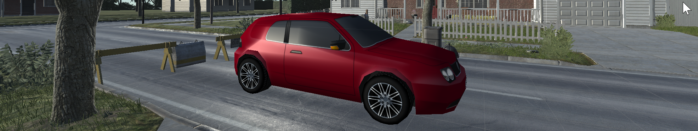
# Training Image Classifiers with Synthetic Data
Ian Branum -- *12 June 2020*

## Table of Contents

- [Introduction](#introduction)
- [Experiment Design](#experiment-design)
- [Data Preparation](#data-preparation)
- [Model Training](#model-training)
- [Analysis](#analysis)
- [Conclusion](#conclusion)
- [Next Steps](#next-steps)
- [Project Details](#project-details)

## Introduction
Neural networks are thirsty creatures. To be properly trained, they require a substantial number of labeled samples, more than any other type of model. For robust image classifiers this means tens of thousands of labeled images. This is a problem. Properly labeling images is a laborious task, particularly if a mask or bounding box is required. An adequate supply of labeled data is one of the major pain points in the development of image classifiers. 

What if we could generate synthetic data and use that data to train image classifiers to classify real world images? It is common practice to augment existing labeled data through various transformations (flip, skew, colorize, blur, etc.) to 'create' additional data from existing data, but what if we could produce completely new data in a virtual environment, a game development environment such as Unity3D? That might be interesting. 

Unsurprisingly, I am not the first to have thought of this. Unity3D even has a [blog post](https://resources.unity.com/unity-technologies-blog/synthetic-data-simulating-myriad-possibilities-to-train-robust-machine-learning-models) on the topic, but the blog post talks of possibilities. I wanted to test the concept, see if it works. The results are this study. I wanted to use Unity3d to create labeled and masked images of cars and pickup trucks from many angles in various environments. I would then train a neural network on these images. Finally, I would test the trained model against real images to see if the trained neural network could a) identify that there is a vehicle in the photo and b) differentiate between a car and a pickup truck. Details of each of these steps follow. 

## Experiment Design
The first step was to lay out the nature of the experiment and success criteria. I wanted to see if I could train a neural network model, using synthetic data only, to then detect and classify real world objects. I decided to use objects one would find on a busy street, such as cars, trucks, and pedestrians. As a starting point, I chose two classes, 'car' and 'pickup truck' for the initial experiment. The test was two-tiered: first, does the model see the vehicle and second, can it correctly classify it as car or pickup truck. 

For the neural network architecture, decided to use a Mask Region Convolutional Neural Network (Mask R-CNN). This is similar to R-CNNs, but requires a mask rather than just a bounding box around the subject. I chose this one because they seem to be particularly effective for object detection and classification, but also because I can. The most painful part of Mask R-CNN is creating the masks and I figured I'd be able to do that programmatically in Unity3d. I was right. For the R-CNN backbone I left it at the tried both Resnet-50 and Resnet-101, choosing Resnet-101 as I was getting adequate run times with it. I tried both starting with random weights and also with the Microsoft COCO data set to take advantage of transfer learning. Finally, I chose 256x256 RGB as the image format. Larger, 1024x1024 say, would have been better, but I feared for the training times that might involve. 

Finally, I decided to run the entire project on AWS Sagemaker notebooks. I used an ml.p3.2xlarge (8 cores, 61GB RAM, and a GPU) for training and a ml.4gdn.xlarge (4 cores, 16GB of RAM, and a GPU) for prediction and evaluation. 

## Data Preparation
The first step was to prepare data. In this case I need to synthesize training data and then collect and prepare testing data, two very different processes. Each had to result in 256x256 RGB images. 

### Training Data
For training data, I need to create images of cars and pickups from various angles, at various distances, in various environments. I purchased a set of 3D models on the Unity Asset Store and selected 21 vehicles, 13 cars and 8 pickup trucks. I selected two pre-built environments, one urban and one suburban. As a third environment I used a blank background, thus giving the model a clean view of each vehicle. I created a virtual gimbal that would rotate five cameras, set at various distances and elevations, around the vehicles as it 'drove' through the environment. 

> Unity Environment
> 

Here is the gimbal and camera positions.
> Gimbal
> 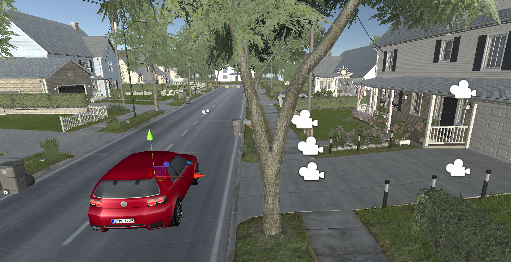

Using this setup I was able to produce 23,760 256x256 RGB images of cars and trucks in three environments along with their corresponding masks. This I believed was sufficient data to make the try. In some of the images the target was occluded, partially or fully, but this was a tiny percentage. I hoped that this would not be an issue for training, but was not going to go through manually and remove them. 
> Training Data
> 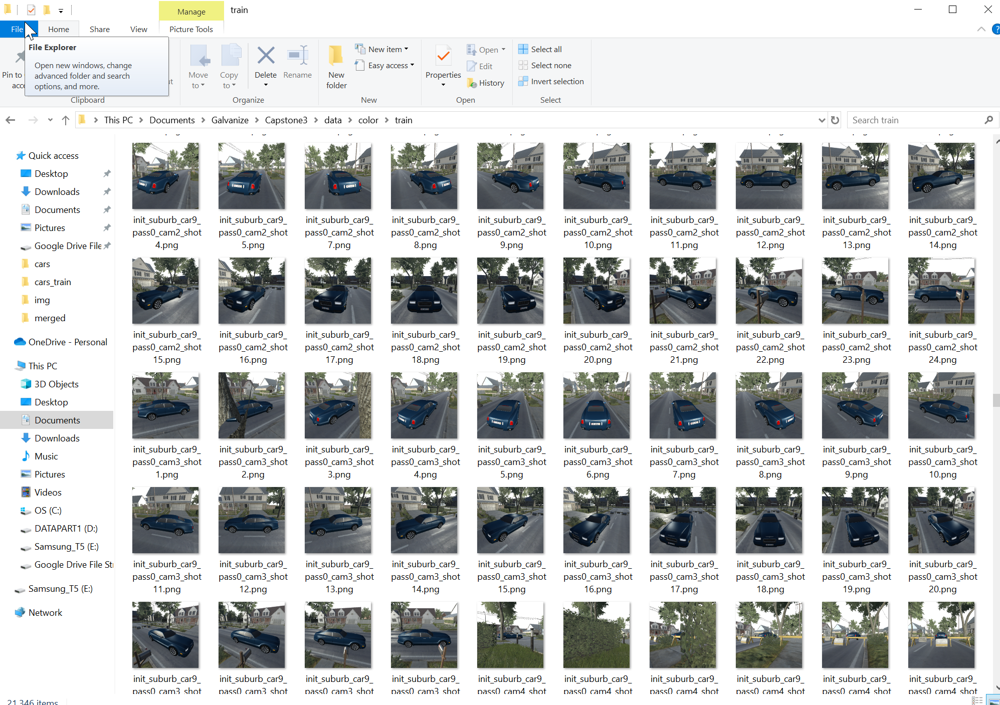

### Testing Data
For test data I needed real picture of real cars and pickups. I used a subset of images from the Stanford 'Cars' dataset. I hand selected cars and pickups, skipping over SUVs and cross-overs as they are neither clearly car nor truck. As this was a manual process I chose a small set, 50 of each. I added 10 images with neither car nor pickup in them as well. I would have preferred a larger test set, but determined that this was enough to prove the point. These I then resized to 256x256 RGB and labeled. 

## Model Training and Analysis
I trained the model both with the Microsoft COCO data set as a base, to take advantage of transfer learning, and with random weights. I was worried that the COCO weights might poison the experiment so I ran it for one epoch and then evaluated. It did horribly, scoring a precision of 0.16 against validation data and .01 against the test data. This convinced me that I could use transfer learning safely, but I ran both ways regardless. Table 1 summarizes the results. I chose precision as the metric arbitrarily as I do not have a use case requiring a specific metric. Had I included pedestrians I might have used recall, as missing a pedestrian might be disastrous. For now, precision it is. 

First, I looked at the average precision scores on the train and validation sets. Really, this is only slightly interesting -- that a model trained on synthetic data can predict against synthetic data proves little -- but is important to inspect to ensure that the model is not over-fitting. Validation precision scores were always very close to training so no over-fitting appeared to be occurring, even after 25 epochs. This suggests that a LOT of training epochs could be sustained. Table 1 summarizes the results. 

>Table 1 - average precision scores against training and validation data

| Epochs | COCO  |   Train   |   Val     |
|:------:|:-----:|:---------:|:---------:|
|    5   |  No   |   0.78    |   0.79    |
|    10  |  No   |   0.92    |   0.91    |
|    25  |  No   |   0.96    |   0.95    |
|    5   |  Yes  |   0.80    |   0.81    |
|    10  |  Yes  |   0.88    |   0.88    |
|    25  |  Yes  |   0.95    |   0.94    |

Next came the interesting part, looking at the test results. First, the non-transfer-learning results. Overall it is performing well. After only five epochs it is managing a 88% percent recall on the detection task, though it is struggling with the classification task. Twenty epochs later its creeping up on the classification. As it is showing no signs of over-fitting, I believe that this model could be subjected to many more training epochs. 

| Cars | Pickups | 
:-------------------------:|:----------------------------:
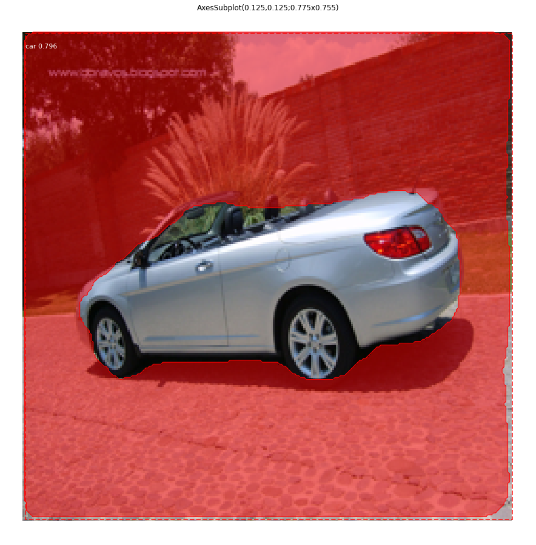   | 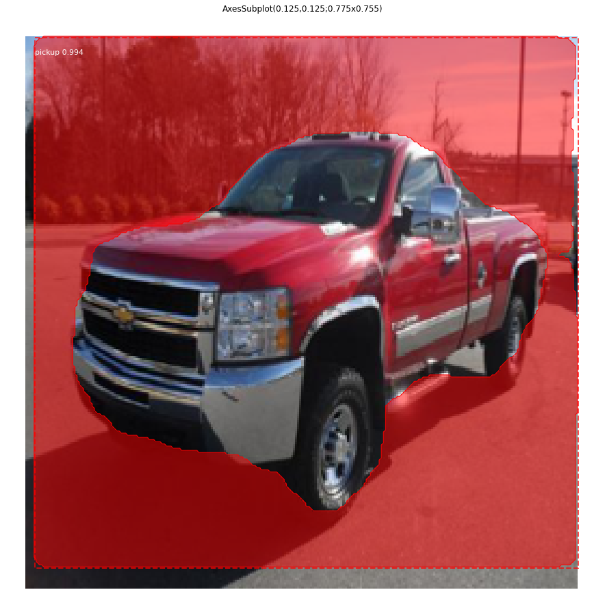
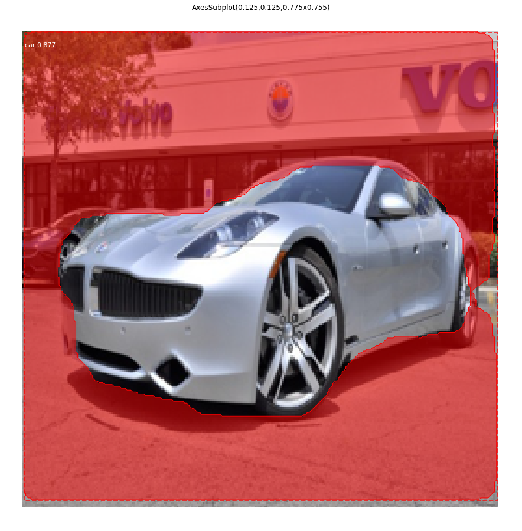   | 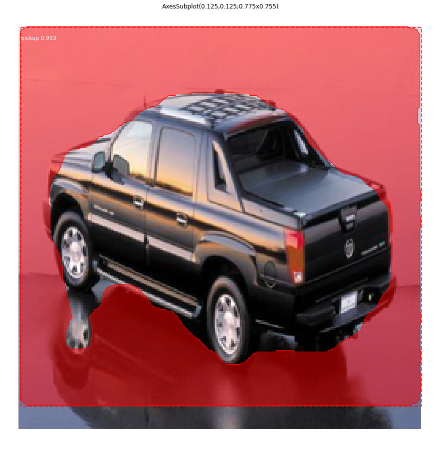

It is not perfect and finds a few non-vehicles as well. 

| Not a car | Not a pickup | 
:-------------------------:|:----------------------------:
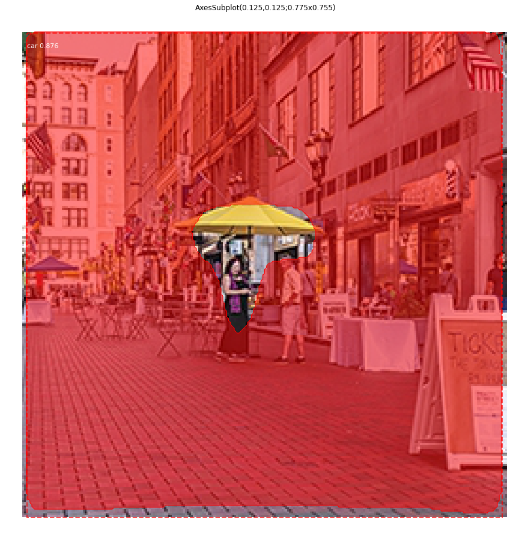   | 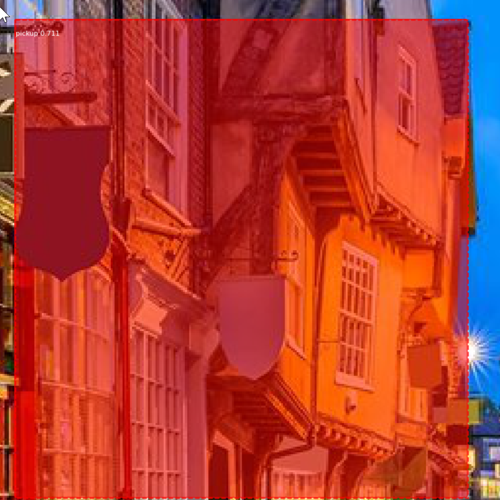

Next, the pre-trained model. I first ran it for one short epoch to watch it fail. This ensures that its performance is based not predominately on its previous training, but its subsequent training. Strangely, it does not do quite as well on the detection task and pretty much believes everything is a pickup truck on the classification task. Maybe it is from Texas. Again, no signs of overfitting so perhaps with more training it would get over its pickup truck obsession. 

>Charts 1 & 2 - Recall on test dataset for randomized initial weights and for MS COCO initialized weights

| Chart 1 | Chart 2 | 
:-------------------------:|:----------------------------:
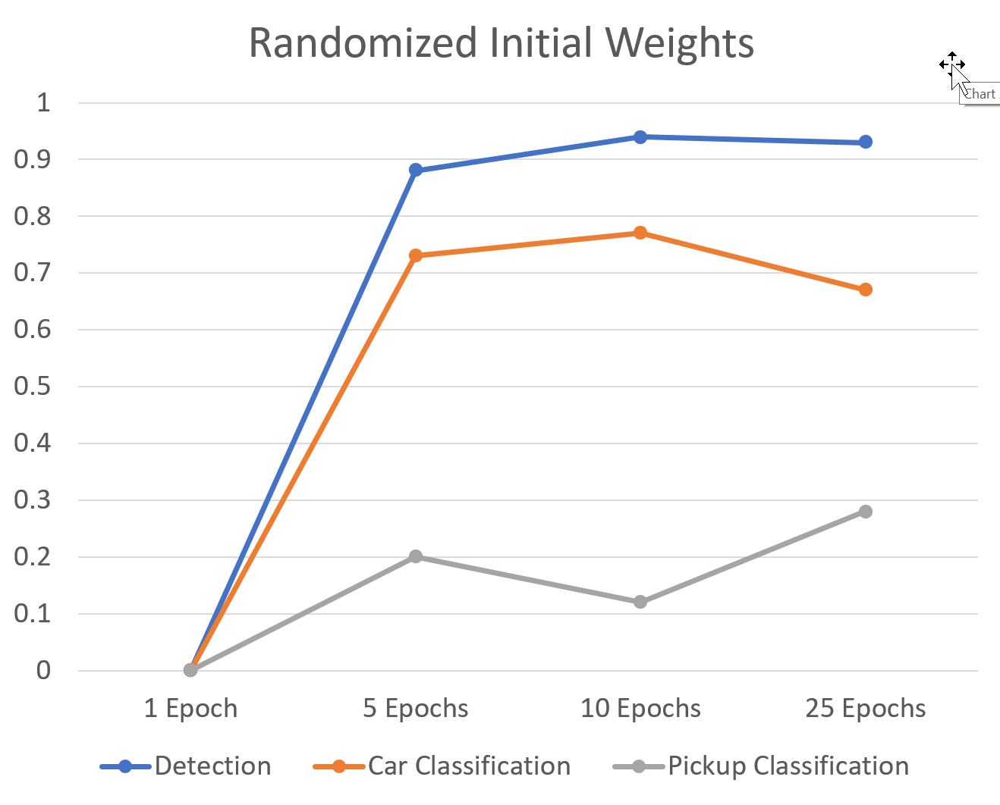   | 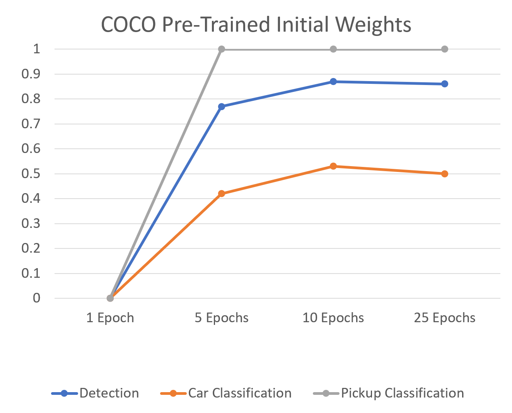

>Charts 3 & 4 - Corresponding confusion matrixes at 10 epochs

| Random weight initialized | Pre-trained | 
:-------------------------:|:----------------------------:
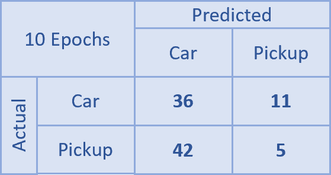   | 

## Conclusion
A neural network model trained exclusively on synthetic images does a creditable job of identifying the presence of vehicles in an image after a fairly short training period. It does less well on classifying the type of vehicle in the image, but was getting incrementally better with each epoch. With transfer learning, the model performed not quite as well on detection (but still 88%) and had a strong bias towards classifying vehicles as pickup trucks. Both were weak on classification. Nonetheless both were successful to some extent, suggesting that the use of synthetic data to train image classifiers is effective. 

## Next Steps
This only a first step, this project can be expanded along several lines. First, I had intended to have more than two classes of objects. Adding pedestrians, trucks, ambulances, police cars, etc. would increase the challenge. Second, more backgrounds are needed. In truth I only used two, urban and suburban. Third, more images. Finally, more training epochs for both models, until they show signs of overfitting.  

## Project Details
This repository contains all of the code required to run the Mask R-CNN model and the image processing code. It does not contain the Unity3d code required to generate the synthetic data. I used several purchased assets that I have license to use, but not re-distribute. Also, the Unity3d project is five gig. 

### Project Layout
The project is in two major directories:
- data-prep: contains all of the data preparation code.
- model: contains the training, prediction and evaluation code. Inside, the mrcnn directory contains the Mask R-CNN library and the models directory is where weights files are stored. 

### Installation
To install on Sagemaker one must run "python3 setup.py install" to setup the Mask R-CNN framework. That should do most of the installation of the Mask R-CNN library, but I got inconsistent results. At the top of each notebook is a block of commented apt-gets and pip installs. I found that I would sometimes have to run those as well. 

## Credits
- I used the very excellent Mask R-CNN implementation by Waleed Abdulla (available [here](https://github.com/matterport/Mask_RCNN)) as the foundation for my model. The code is in the mrcnn directory. It is very well documented, easy to understand, works like a charm, and I can recommend it to anyone interested in R-CNNs without reservation. 
- For testing data I used a subset of the Stanford 'Cars' data available [here](https://ai.stanford.edu/~jkrause/cars/car_dataset.html).